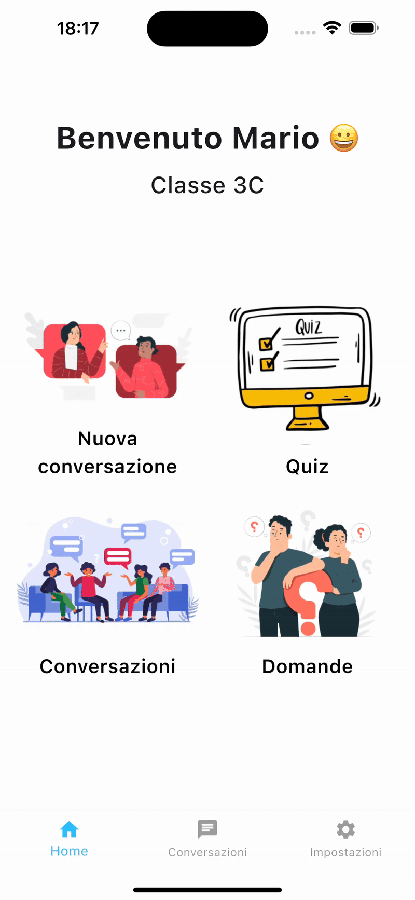

# HistorIA


> "La Storia raccontata da chi l’ha vissuta!"

HistorIA è un'applicazione Flutter per Android e iOS progettata per rivoluzionare l'apprendimento della storia attraverso un'interazione esperienziale con personaggi storici virtuali. Gli studenti possono parlare con Giulio Cesare o Napoleone, affrontare quiz coinvolgenti e salvare le loro conversazioni per riflettere o condividerle. L'insegnante può inoltre visualizzare le domande condivise dagli studenti per monitorare l'interesse e il coinvolgimento.

---

## 🧠 Caratteristiche principali

- 🗣️ **Conversazioni dinamiche** con personaggi storici (Cesare, Napoleone)
- 🔈 **Text-to-Speech (TTS)** integrato per l'ascolto delle risposte dei personaggi
- 🧪 **Quiz interattivi** a scelta multipla
- 💬 **Salvataggio e condivisione** delle conversazioni
- 👩‍🏫 **Accesso differenziato** per studenti e docenti
- 🔍 **Visualizzazione da parte dei docenti delle domande condivise dagli studenti**
- 🧠 Risposte generate da LLM **LLaMA 3.2** via **Ollama**

---

## 📱 Screenshot

| Conversazione                         |
| ------------------------------------- |
|  |

---

## 🛠️ Come avviare l'app

### 1. Requisiti

- [Flutter SDK](https://flutter.dev/docs/get-started/install)
- [Android Studio](https://developer.android.com/studio) o [Xcode](https://developer.apple.com/xcode/) (per simulatore iOS)
- [Ollama](https://ollama.com) installato localmente

### 2. Clona la repo

```bash
git clone https://github.com/Antonio-Caiazzo/Gruppo-1-IUM-2024-2025.git
cd Gruppo-1-IUM-2024-2025
```

### 3. Installa le dipendenze

```bash
flutter pub get
```

### 4. Avvia Ollama con LLaMA 3.2

Assicurati di avere [Ollama](https://ollama.com/download) installato e attivo:

```bash
ollama serve
ollama run llama3.2
```

> ✅ **IMPORTANTE**: per chi utilizza **MacOS**, dopo l'installazione di Ollama potrebbe essere necessario autorizzare l'esecuzione dei binari da "Sicurezza e Privacy" nelle Impostazioni di sistema.

### 5. Avvia l’app

#### Android

```bash
flutter run -d android
```

#### iOS

Su Mac con Xcode:

```bash
flutter run -d ios
```

> 💡 Se incontri problemi su iOS, verifica che **shared_preferences** sia correttamente abilitato nel file `ios/Runner/Info.plist`. In caso contrario, segui la [guida ufficiale](https://pub.dev/packages/shared_preferences) per la configurazione su iOS.

#### Web

```bash
flutter run -d chrome
```

---

## 🔍 Architettura del progetto

```
lib/
├── models/                     # Modelli come Conversation, Domanda
├── screens/                   # Tutte le schermate: login, home, quiz, conversazioni...
├── widgets/                   # Componenti riutilizzabili (es. bottoniere, campi di testo)
├── constants/                 # Colori e stili globali
└── main.dart                  # Entry point
```

---

## 👨‍👩‍👧 Ruoli

### 👨‍🏫 Studente

- Seleziona profilo "Studente"
- Svolge quiz
- Parla con personaggi storici
- Salva o condivide le conversazioni
- Visualizza le domande assegnate dal docente e le rivolge al personaggio storico

### 👩‍🏫 Insegnante

- Seleziona profilo "Insegnante"
- Inserisce domande personalizzate
- Visualizza le domande inserite
- Consulta le domande condivise dagli studenti
- Può accedere alle conversazioni condivise

---

## 🤝 Contribuire

1. Forka il progetto:

   ```bash
   git checkout -b feat/mia-feature
   ```

2. Apri una Pull Request

Mantieni uno stile coerente e nomi descrittivi per PR e commit.

---

## 💼 Credits

- **Gruppo 1 – IUM 2024/2025**

  - Antonio Caiazzo
  - Choaib Goumri
  - Emanuele Iovane
  - Armando Vigliotti

- **Università degli Studi di Salerno**

  - Corso: _Interazione Uomo-Macchina_
  - **Professoressa**: Giuliana Vitiello
  - **Tutor**: Andrea Antonio Cantone

- LLM: [LLaMA 3.2](https://ollama.com/library/llama3) via [Ollama](https://ollama.com)

- Icone: [Material Icons](https://fonts.google.com/icons)

---

<p align="center"><em>Buono studio e... buona conversazione! 📚🔨</em></p>
